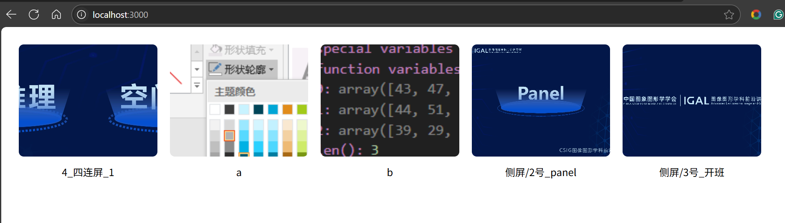

### 简易的图片浏览工具

deepseek写的，方便内部网的其他人看本地文件夹的图片内容，不过目前是直接读取文件夹全部图片，大文件夹慎用

+ 在 `img` 文件夹放入图片
+ 安装依赖 npm install express
+ 运行node server.js
+ 访问http://localhost:3000

---

+ 该方案特点：
+ 显示图片名称与子目录路径（不含后缀
+ 点击图片可放大查看原始比例
+ 放大模式下显示完整路径名称
+ 支持左右切换浏览图片
+ 保持原始目录结构访问

#### TODO

或许后面让加上其他文件的阅览功能